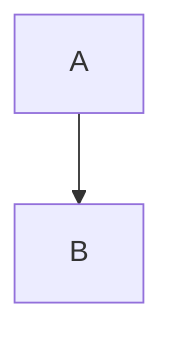
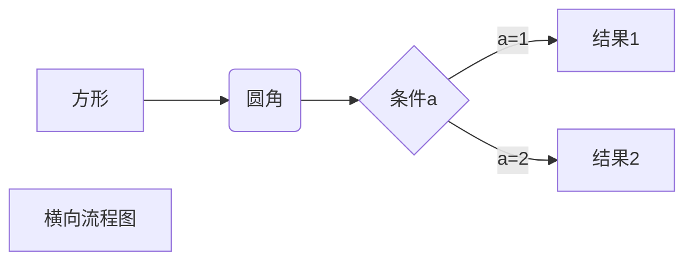
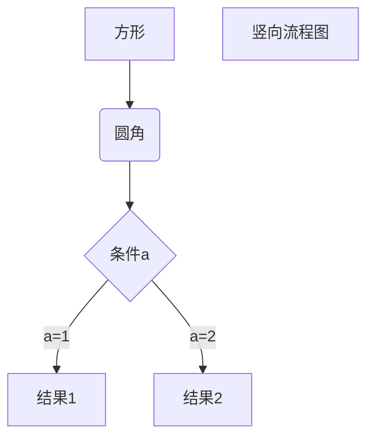
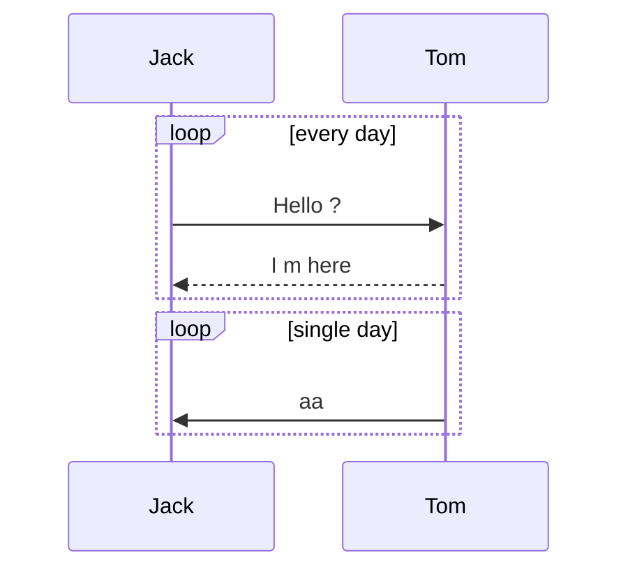
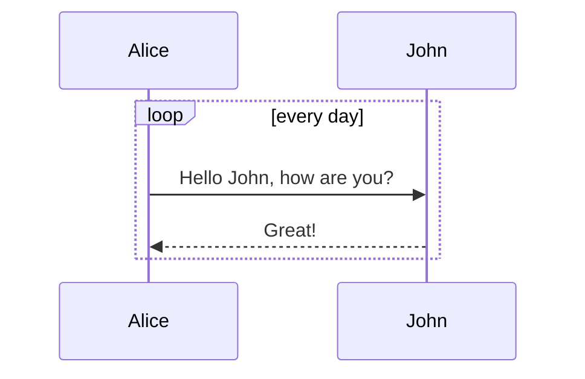
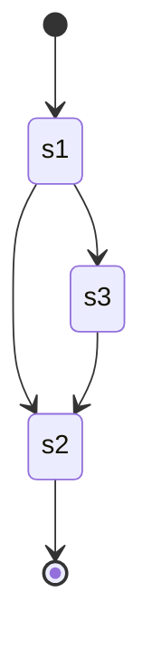
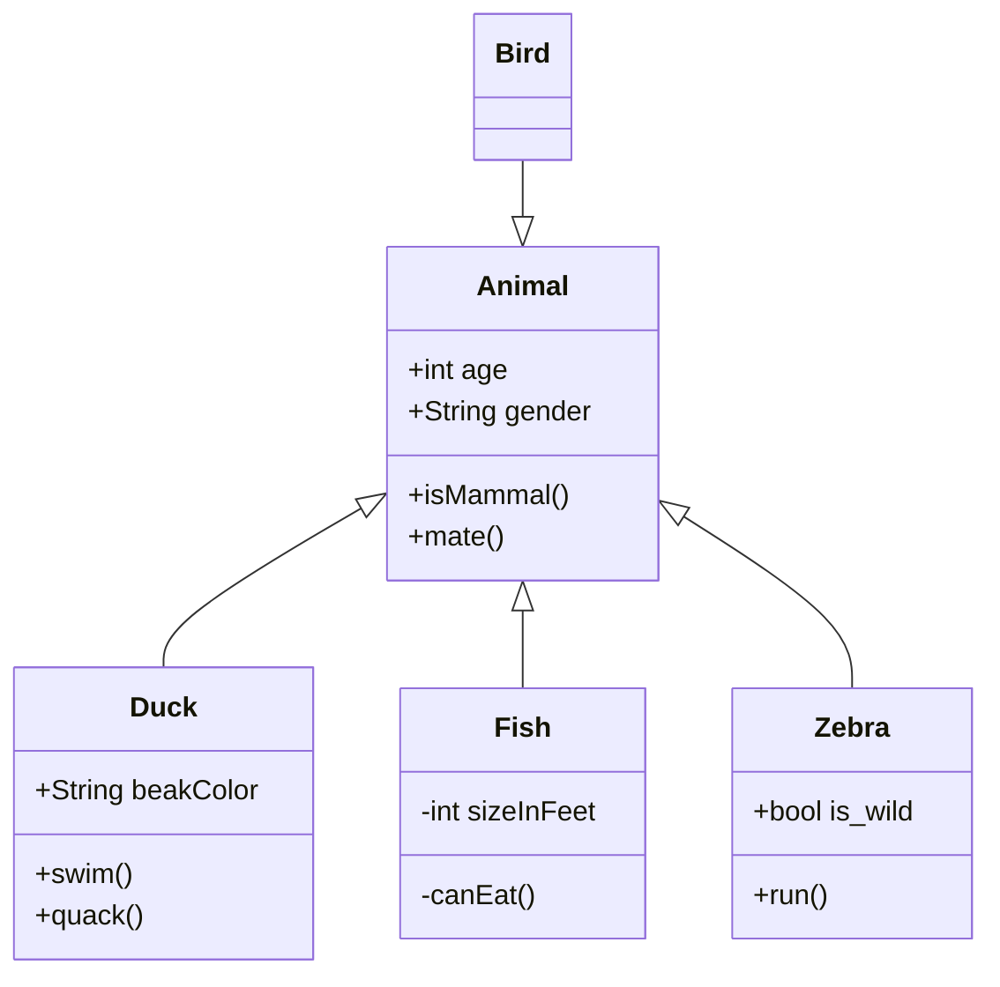
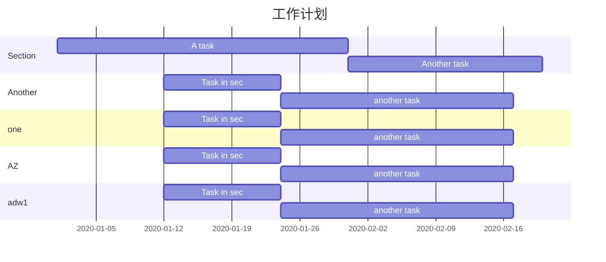
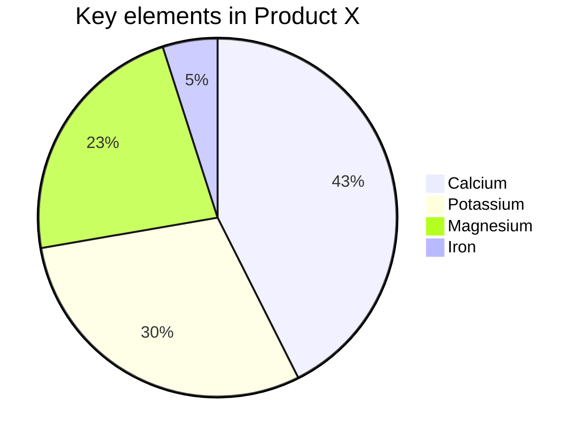

[TOC]

**生成目录：**[TOC]


# 一、标题(Cmd + 1-6)


# 一级标题

## 二级标题
### 三级标题...


# 二、字体


**加粗**(cmd + b)
*斜体*(cmd + i)

***斜体加粗***

~~删除线~~
==高亮==（需要在偏好设置中开启，cmd + shift + h）
<u>下划线</u>(cmd + u)

<!--注释-->(ctrl + -)


# 三、引用（Cmd + Opt + Q）


>引用内容
>
>>引用内容
>>
>> > > > > > > 引用内容

# 四、分割线


---
----
***
****


# 五、图片（Crtl + Cmd + I）


# 六、超链接（Command + K）

[google](https://google.com)

[超链接名](超链接地址 )
[百度][http://baidu.com]

[百度]:http://baidu.com	""Sample""

<http://baidu.com>


# 七、列表


## 无序列表（Cmd + Opt + U）

- 列表内容
+ 列表内容
* 列表内容

## 有序列表（Cmd + Opt + O）

1. 列表内容
2. 列表内容
3. 列表内容

## 列表嵌套
上一级和下一级之间三个空格/tab

- 一级无序列表内容
    - 二级无序列表内容
    - 二级无序列表内容
    - 二级无序列表内容
- 一级无序列表内容
    1. 二级有序列表内容
    2. 二级有序列表内容
    3. 二级有序列表内容
1. 一级有序列表内容
    - 二级无序列表内容
    - 二级无序列表内容
    - 二级无序列表内容
2. 一级有序列表内容
    1. 二级有序列表内容
    2. 二级有序列表内容
    3. 二级有序列表内容


# 八、表格（Opt + Cmd + T）


| 表头 | 表头 | 表头 |
| :--- | :--: | ---: |
| 内容 | 内容 | 内容 |
| 内容 | 内容 | 内容 |

第二行分割表头和内容。
- 有一个就行，为了对齐，多加了几个
文字默认居左
- 两边加：表示文字居中
- 右边加：表示文字居右
注：原生语法两边都要用 | 包起来


# 九、代码


## 语法：  

单行代码：代码之间分别用一个反引号包起来

`代码内容......`  

代码块：代码之间分别用三个反引号包起来，且两边的反引号单独占一行**（Opt + Cmd + C）**

```
代码块儿
......
```
## 示例：
单行代码

`create database hero`  

代码块

```react
class test extend Component {
  handleClick = (e) => {
    console.log(e)
  }
  return (
  	<h1 onClick={this.handleClick}>This is a test demo</h1>
  )
}
```


# 十、进阶&绘图

## 1. To-do List

- [ ] madw

- [ ] demo

- [ ] addwa

- [ ] 已完成项目1
    - [ ] 已完成事项1
    - [ ] 已完成事项2
- [ ] 待办事项1
- [ ] 待办事项2


## w2. 高效绘制




### 流程图






### 序列图





### 状态图

[*]表示开始或结束，在箭头右边表示结束





### 类图




### 甘特图



### 饼图



# 十一、Typora快捷键

## 文件

| 功能               | 热键（macOS）       |
| ------------------ | ------------------- |
| 新建               | Command + N         |
| 新窗户             | Command + Shift + N |
| 新标签             | Command + Shift + N |
| 打开               | Command + O         |
| 快速打开           | Command + Shift + O |
| 重新打开关闭的文件 | Command + Shift + T |
| 保存               | Command + S         |
| 另存为/重复        | Command + Shift + S |
| 偏爱               | Command +           |
| 关闭               | Command + W         |

## 编辑

| 功能                              | 热键（macOS）                       |
| --------------------------------- | ----------------------------------- |
| 新段落                            | Enter                               |
| 新行                              | Shift + Enter                       |
| 剪切                              | Command + X                         |
| 复制                              | Command + C                         |
| 粘贴                              | Command + V                         |
| 复制为Markdown                    | Command + Shift + C                 |
| 粘贴为纯文本                      | Command + Shift + V                 |
| 全选                              | Command + A                         |
| 选择行/句子 选择行（在表中）      | Command + L                         |
| 删除行（在表中）                  | Command + Shift +退格键             |
| 选择样式范围 选择单元格（在表中） | Command + E                         |
| 选择单词                          | Command + D                         |
| 删除单词                          | Command + Shift + D                 |
| 跳到顶部                          | Command + ↑                         |
| 跳转到选择                        | Command + J                         |
| 跳到底部                          | Command + ↓                         |
| 查找                              | Command + F                         |
| 查找下一个                        | Command + G / Enter                 |
| 查找上一个                        | Command + Shift + G / Shift + Enter |
| 替换                              | Command + H                         |

## 段

| 功能              | 热键（macOS）            |
| ----------------- | ------------------------ |
| 标题1至6          | Cmd + 1/2/3/4/5/6        |
| 段落              | Command + 0              |
| 增加/减少标题级别 | Cmd ±                    |
| 表                | Command + Option + T     |
| 代码块            | Command + Option + C     |
| 数学块            | Command + Option + B     |
| 引用              | Command + Option + Q     |
| 有序列表          | Command + Option + O     |
| 无序列表          | Command + Option + U     |
| 缩进              | Command + [/制表符       |
| 突出              | Command +] / Shift + Tab |

## 格式

| 功能   | 热键（macOS）         |
| ------ | --------------------- |
| 加粗   | Command + B           |
| 重点   | Command + I           |
| 下划线 | Command + U           |
| Strike | Ctrl + Shift +`       |
| 超链接 | Command + K           |
| 图片   | Command + Control + I |

## 视图

| 功能                 | 热键（macOS）         |
| -------------------- | --------------------- |
| 切换侧边栏           | Command + Shift + L   |
| 大纲                 | Command + Control + 1 |
| 文章                 | Command + Control + 2 |
| 文件树               | 指令+控制+ 3          |
| 源代码模式           | 指令+ /               |
| 对焦模式             | F8                    |
| 打字机模式           | F9                    |
| 切换全屏             | Command + Option + F  |
| 在打开的文档之间切换 | Command +`            |