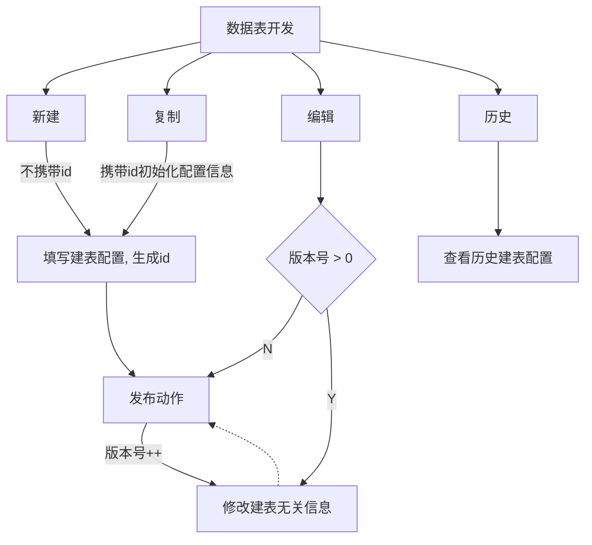

# 需求总览

| 需求名称                         | 时间      | 概述                                                         |
| -------------------------------- | --------- | ------------------------------------------------------------ |
| 数据分析模块（移动端自定义看板） | 9.03-9.29 | 同步pc端看板配置，在移动设备上进行筛选与横屏查看             |
| 数据开发模块（视图表&文件上传）  | 8.20-8.31 | 数据表管理与建表配置流程控制，支持使用上传文件作为数据源进行建表配置 |

## 移动端自定义看板

## 设计

### 交互流程：

看板列表：

看板详情：

图表详情：

### 代码结构：

### 场景：

​	不同类型筛选项修改，状态收集

# 视图表&文件上传

场景：

1. 状态控制

2. 文件上传

## 状态控制

### 状态：

### 业务流程：

## 文件上传

失败尝试：上传控件 -> file对象 -> 二进制流, readAsBinaryString() -> body（fail） 

成功尝试：使用FormatData数据类型 -> append('file', file对象) -> Request设置data: { formdata: true } -> content-type：multipart/form-data

Upload组件api：

Request：

基于xhr 2提供的FormData接口生成FormData对象，使用append（k，v）添加表单项，此时v可以为file对象（该对象基于Blob，扩展了支持用户上传文件的功能，存储文件的相关信息，可通过使用Blob的api进行读取处理，如FileReader）。将FormData对象作为xhr请求的request-body时，请求内容格式content-type会被自动设置为 multipart / form-data，此时文件随表单以数据流的格式上传。

# 总结

1. 合理的设计可以减少开发时的成本，设计时对业务动作的思考也可以帮助避免在实现时容易忽略的问题。
2. 我们所使用的框架、组件，时常不能完美契合需求场景，需要有实现自定义封装，深入底层的能力。
3. 一个完整的需求，需要与设计、产品、后端有充分的沟通，避免开发到后期理解错误带来的时间等损失。

# 学习 & 产出

React-hooks: https://wiki.corp.bianlifeng.com/pages/viewpage.action?pageId=683639109

TypeScript: https://github.com/1257668543/company_study/tree/master/TS (进行中)

