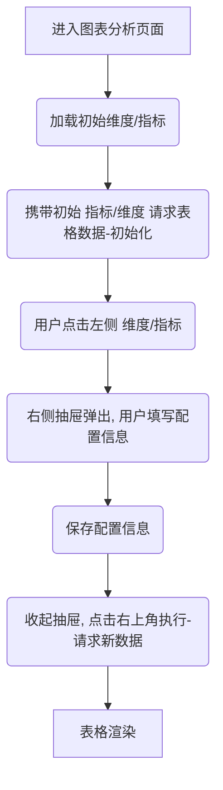
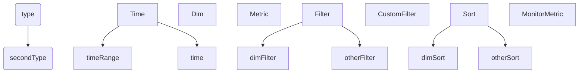
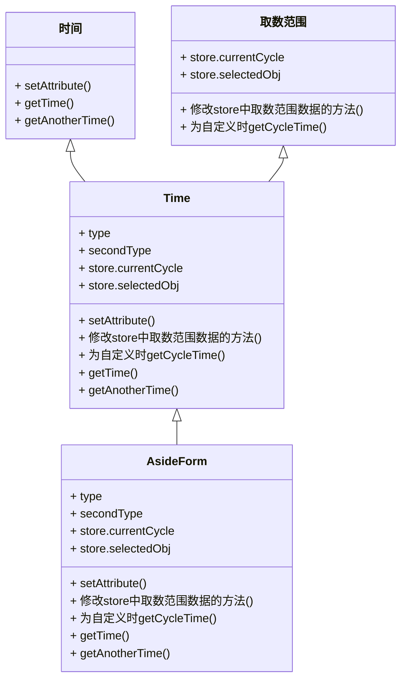
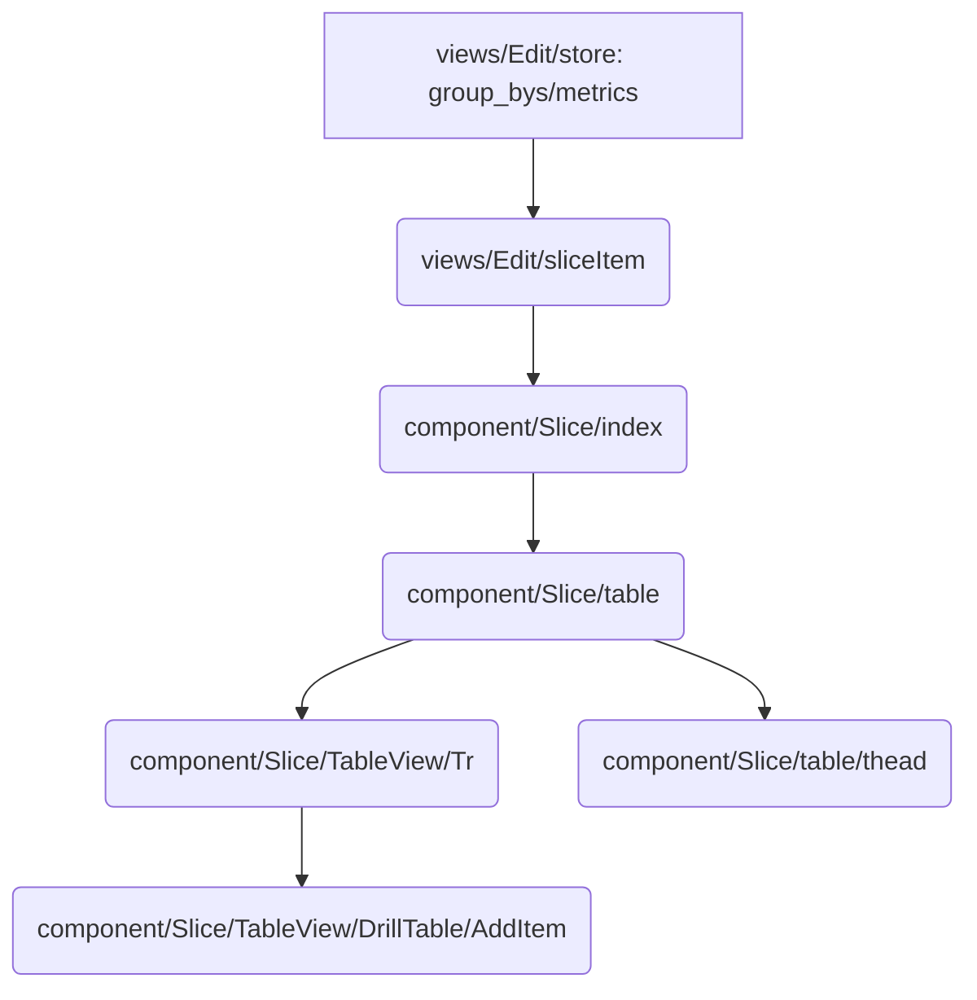

**需求wiki：**[分析图表-分析配置](https://wiki.corp.bianlifeng.com/pages/viewpage.action?pageId=639042227)

# 业务流程

# 对应代码片段(本次需求改动相关)——表格

| 需求实现需要的   组件/函数/属性        | 相关位置                                                     | 描述                                                         |
| :------------------------------------- | :----------------------------------------------------------- | :----------------------------------------------------------- |
| 请求表格数据接口: analysis/slice/query | component/Slice/store 函数：**fetchDataWithCache(data)**     | 携带配置信息**options**发起请求                              |
| 配置信息存储位置                       | component/Slice/store 属性：**options**(通过构造器传入)      | Views/analysis/Edit/store/属性：**sliceDetail** -> 同目录index属性：**params** ->  SliceItem属性：**options** -> component/Slice属性：**options** -> 通过实例化同目录store传入**options** |
| ==右侧抽屉组件==                       | views/analysis/Edit/AsideForm/index                          | renderFields() -> 通过 **props**传入的**type **判断点击的维度/指标类型 |
| **type**                               | views/analysis/Edit/LeftBottom下CompareGroupBys与Filters**静态**写入FieldsContainer/index.js | FieldsContainer/index 函数：**onClickItem(type,  index, key, item)** -> CompareGroupBys / Filters 函数：**onClickItem()** ->   leftBottom/index函数：**onClickItem()** -> analysis/Edit/index函数：**onClickitem()** -> 同目录store函数：**onClickitem()** { 整理参数创建包含**type**的对象**clickItem** } -> analysis/Edit/index从store属性：**clickItem**中解构出**type**传入Edit/AsideForm/index：<AsideForm **type**/> |
| 修改配置信息回调                       | views/analysis/Edit/store.js **函数：**setAttribute(type, index, value, attribute) -> index.js -> <AsideForm setAttribe/> | **type：**判断类型 **index：**对应左侧列表下标 **value：**修改的值 **attribute：**对应配置的属性名 |
| 动态渲染配置项                         | views/analysis/Edit/AsideForm/FormItem.js**组件：**FormItem(label, name, initialValue, rules, type, getFieldDecorator, onChange, data, children, ...props) | **Label:** 表单项显示的文本 **name:**  未知 **initialValue:** getFieldDecorator(initialValue)? **rules: **校验规则 **Type：**需要展示的表单项类型 **onChange：**表单项值变化回调 **Children：**需要展示在表单项下方的JSX元素 |

# 功能模块图

# 维度/对比（宽度与对齐方式）——数据流向

