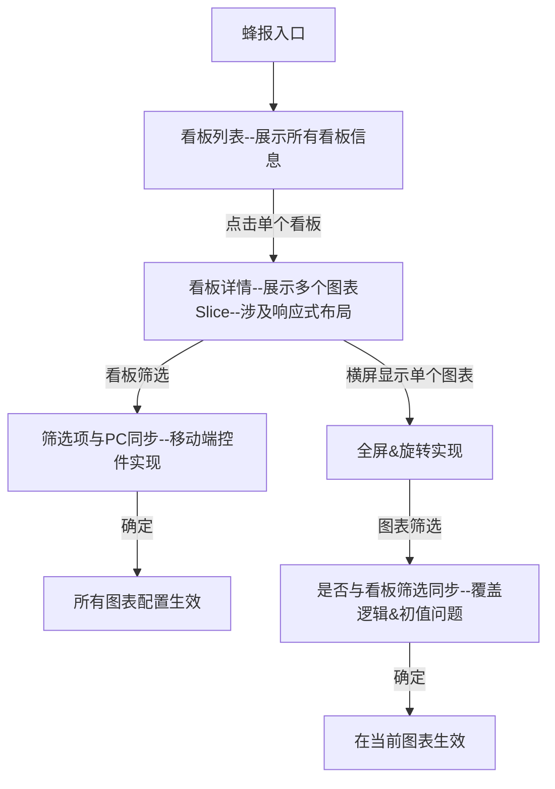

# 业务流程

# 数据

| 页面数据               | 来源                                         | 方法 | 备注                                                      |
| ---------------------- | -------------------------------------------- | ---- | --------------------------------------------------------- |
| 列表页                 | /dpa/api/analysis/dashboard/list             | POST | only_personal是否默认为1（仅查看自己负责的看板）          |
| 看板——图表相关配置信息 | /dpa/api/analysis/dashboard/obtainDashboard  | POST | dashboard_id：对应看板id                                  |
| 单个图表数据           | /dpa/api/analysis/dashboard/querySlice       | POST | 解析params_v2 +  看板/图表 筛选配置？                     |
| 筛选数据集             | /dpa/api/analysis/dashboard/dataSets         | POST | List：当前看板所有图表id数组                              |
| 筛选字段               | /dpa/api/caravel/table/FieldsQuery           | GET  | tableId：当前看板id                                       |
| 筛选字段值             | /dpa/api/analysis/dashboard/queryFieldValues | POST | data_set_id：所选数据集id field：所选字段column_name |

# 问题

1. 单个图表展示高度是否统一，还是展示所有内容。若不统一，在pad上展示会存在留白问题。
2. 是否同步pc筛选配置åå
3. 移动端看板是否可以新增筛选项，还是只使用pc保存的筛选项进行筛选。
4. 若支持新增筛选项，是否支持保存？